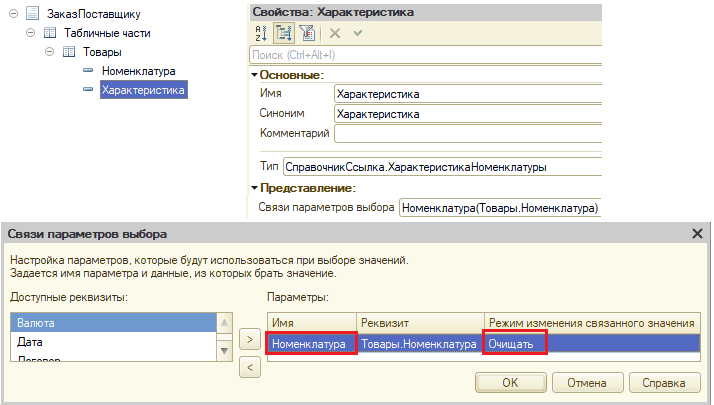
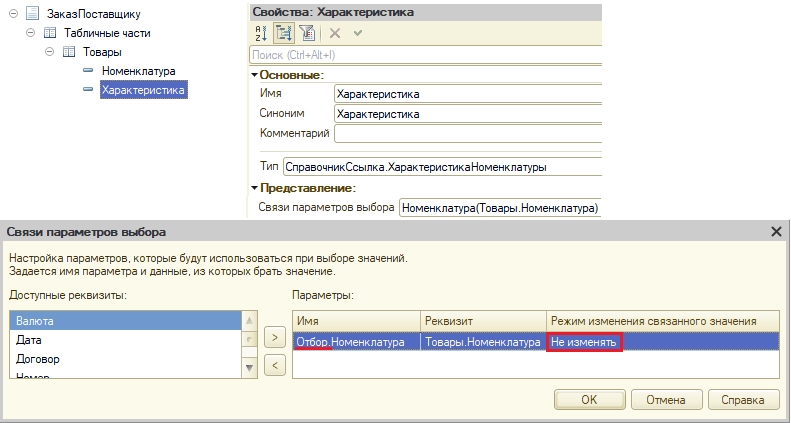
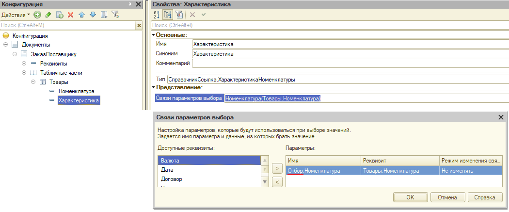

###### #std411

# Установка параметров выбора и связей параметров выбора для объектов метаданных

###### 1.

Ограничения бизнес-логики, например ограничения выбора, обычно должны работать одинаково во всех формах редактирования объекта.

Поэтому параметры выбора и связи параметров выбора рекомендуется задавать в свойствах объектов метаданных: реквизитов справочников, документов и т.п.

###### 2.

В отдельных сценариях ограничения выбора зависят от конкретной формы.
В таких случаях параметры выбора можно уточнять по месту, в форме.

Например, в конфигурации есть:

- справочник `Сотрудники` с реквизитами `Организация` и `ВидСотрудника` (перечисление со значениями `Основной` и `Совместитель`);
- документ `ПриказОПриеме` с реквизитами `Организация` и `Сотрудник`.

Для реквизита `Сотрудник` документа `ПриказОПриеме` задана связь параметра выбора `Отбор.Организация` с реквизитом `Организация`.

Нужно реализовать выбор только основных сотрудников в зависимости от функциональной опции `ВыбратьТолькоИзОсновыхСотрудников`.
Для этого:

- в форме документа `ПриказОПриеме` добавляют реквизит формы `ВидыСотрудников`;
- для поля формы `Сотрудник` задают связь параметра выбора `Отбор.ВидСотрудника` с реквизитом формы `ВидыСотрудников`;
- реквизит формы `ВидыСотрудников` заполняют по значению функциональной опции.

Связь `Отбор.ВидСотрудника` нельзя задать в свойствах реквизита `Сотрудник` самого документа `ПриказОПриеме`, потому что у документа нет реквизита `ВидСотрудника`.

В результате будут работать обе связи параметров выбора:

- по `Отбор.Организация` (из свойств реквизита документа);
- по `Отбор.ВидСотрудника` (из поля формы).

Это дает отбор сотрудников одновременно по организации документа и по виду сотрудника, вычисленному по функциональной опции.

###### 3.

Параметры выбора из метаданных объектов учитываются при выборе значений в отборах отчетов и динамических списков.
Поэтому задавайте их и для объектов, которые не редактируются интерактивно.

Например, в конфигурации есть:

- справочник `Номенклатура` с реквизитом `ТипНоменклатуры` (перечисление со значениями `Товар` и `Услуга`);
- регистр накопления `ТоварыНаСкладе` с измерением `Номенклатура`;
- отчет по регистру `ТоварыНаСкладе` с быстрым отбором по измерению `Номенклатура`.

Если в свойствах измерения `Номенклатура` задать параметр выбора `Отбор.ТипНоменклатуры` со значением `Товар`, список доступных значений в отборе отчета сократится.
Выбрать номенклатуру с типом `Услуга`, которая не может храниться на складе, будет нельзя.

###### 4.

Не задавайте в связях параметров выбора `Режим изменения связанного значения` = `Очищать`.
Вместо этого пишите код, который очищает зависимое значение только при несоответствии новым значениям ведущих реквизитов.

При безусловной очистке возможны проблемы:

- при повторном выборе того же ведущего значения (без фактического изменения) зависимый реквизит будет очищен;
- если значение зависимого реквизита соответствует нескольким значениям ведущего, ранее выбранное значение будет очищено, даже если остается допустимым.

Например, в конфигурации есть:

- справочник `Номенклатура` с реквизитом `ВидНоменклатуры`;
- справочник `ХарактеристикиНоменклатуры` с реквизитом `Владелец` типа `СправочникСсылка.ВидыНоменклатуры`;
- документ `ЗаказПоставщику` с табличной частью `Товары`, в которой есть реквизиты `Номенклатура` и `Характеристика` типа `СправочникСсылка.ХарактеристикиНоменклатуры`.

`Владелец` характеристики должен соответствовать реквизиту `ВидНоменклатуры` выбранной номенклатуры.

!!! failure "Неправильно"

    Связь параметра выбора реквизита `Товары.Характеристика`:

    ```text
    Имя:                                 Номенклатура
    Реквизит:                            Товары.Номенклатура
    Режим изменения связанного значения: Очищать
    ```

    { width="714" }

!!! success "Правильно"

    Связь параметра выбора реквизита `Товары.Характеристика`:

    ```text
    Имя:                                 Отбор.Номенклатура
    Реквизит:                            Товары.Номенклатура
    Режим изменения связанного значения: Не изменять
    ```

    { width="791" }

Про префикс `Отбор.` в имени параметра см. п. `5`.

Пример условной очистки:

```bsl
&НаКлиенте
Процедура ТоварыНоменклатураПриИзменении(Элемент)
    ТекущаяСтрока = Элементы.Товары.ТекущиеДанные;
    ТекущаяСтрока.Характеристика = ХарактеристикаПоУмолчанию(
        ТекущаяСтрока.Номенклатура, ТекущаяСтрока.Характеристика);
КонецПроцедуры

// Возвращает характеристику по умолчанию для номенклатуры.
//
// Параметры:
//  Номенклатура    - СправочникСсылка.Номенклатура - номенклатура, для которой нужна характеристика.
//  ТекущееЗначение - СправочникСсылка.ХарактеристикиНоменклатуры - текущее значение характеристики.
//
// Возвращаемое значение:
//  СправочникСсылка.ХарактеристикиНоменклатуры - подобранное значение:
//     1. текущее значение, если оно удовлетворяет условиям;
//     2. единственное значение, соответствующее условиям;
//     3. пустая ссылка, если подходящих значений нет или их несколько.
//
&НаСервереБезКонтекста
Функция ХарактеристикаПоУмолчанию(Номенклатура, ТекущееЗначение)

    Запрос = Новый Запрос;
    Запрос.Текст =
        "ВЫБРАТЬ ПЕРВЫЕ 2
        |   ХарактеристикиНоменклатуры.Ссылка КАК Ссылка,
        |   ХарактеристикиНоменклатуры.Ссылка = &ТекущееЗначение КАК ЭтоТекущееЗначение
        |ИЗ
        |   Справочник.Номенклатура КАК Номенклатура
        |       ВНУТРЕННЕЕ СОЕДИНЕНИЕ Справочник.ХарактеристикиНоменклатуры КАК ХарактеристикиНоменклатуры
        |       ПО Номенклатура.ВидНоменклатуры = ХарактеристикиНоменклатуры.Владелец
        |ГДЕ
        |   Номенклатура.Ссылка = &Номенклатура
        |
        |УПОРЯДОЧИТЬ ПО
        |   ЭтоТекущееЗначение УБЫВ";

    Запрос.УстановитьПараметр("Номенклатура", Номенклатура);
    Запрос.УстановитьПараметр("ТекущееЗначение", ТекущееЗначение);

    Выборка = Запрос.Выполнить().Выбрать();

    Если Не Выборка.Следующий() Тогда
        // Ни одно значение не подходит
        Возврат Справочники.ХарактеристикиНоменклатуры.ПустаяСсылка();
    ИначеЕсли Выборка.ЭтоТекущееЗначение Или Выборка.Количество() = 1 Тогда
        // Текущее значение подходит или найдено единственное подходящее
        Возврат Выборка.Ссылка;
    Иначе
        // Значений несколько, выбрать значение по умолчанию невозможно
        Возврат Справочники.ХарактеристикиНоменклатуры.ПустаяСсылка();
    КонецЕсли;

КонецФункции
```

###### 4.1.

Безусловная очистка (`Режим изменения связанного значения` = `Очищать`) допустима, если одновременно выполняются условия:

- повторный выбор значения ведущего реквизита без его фактического изменения невозможен;
- каждому значению зависимого реквизита соответствует не более одного значения ведущего реквизита.

Например, в конфигурации есть:

- справочник `ВидыЦен` с реквизитом `ЦенаВключаетНДС` типа `Булево`;
- документ `ЗаказПоставщику` с реквизитами `ЦенаВключаетНДС` и `ВидЦены`; на форме документа для реквизита `ЦенаВключаетНДС` выведено поле с `Вид` = `Поле флажка`.

Значение флажка `ЦенаВключаетНДС` у выбранного вида цен должно совпадать со значением ведущего реквизита `ЦенаВключаетНДС` документа, потому что:

- для поля с видом `Поле флажка` нельзя повторно установить текущее значение: например, нельзя установить `Истина`, если флажок уже взведен;
- `ВидЦены` всегда соответствует только одному значению флажка `ЦенаВключаетНДС`.

В этом случае безусловная очистка зависимого реквизита `ВидЦены` при изменении ведущего флажка `ЦенаВключаетНДС` допустима.

###### 5.

Новый объект может создаваться из поля выбора или формы выбора с установленными отборами.
Чтобы заполнить его реквизиты, добавляйте нужные параметры выбора в структуру `Отбор`: ее свойства и значения передаются в параметр `ДанныеЗаполнения` события `ОбработкаЗаполнения`.

Для этого перед именем параметра добавьте префикс `Отбор.`.

```text
Имя:                                 Отбор.Номенклатура
Реквизит:                            Товары.Номенклатура
Режим изменения связанного значения: Не изменять
```

{ width="1050" }

Модуль объекта справочника `ХарактеристикиНоменклатуры`:

```bsl hl_lines="4"
Процедура ОбработкаЗаполнения(ДанныеЗаполнения, ТекстЗаполнения, СтандартнаяОбработка)

    Если ТипЗнч(ДанныеЗаполнения) = Тип("Структура")
        И ДанныеЗаполнения.Свойство("Номенклатура") Тогда
        Владелец = ОбщегоНазначения.ЗначениеРеквизитаОбъекта(
            ДанныеЗаполнения.Номенклатура, "ВидНоменклатуры");
    КонецЕсли;

КонецПроцедуры
```

###### См. также

- [#std396: Обработчик события ОбработкаЗаполнения](396.md)
- [#std470: Использование функциональных опций](470.md)

###### Источник

https://its.1c.ru/db/v8std#content:411
