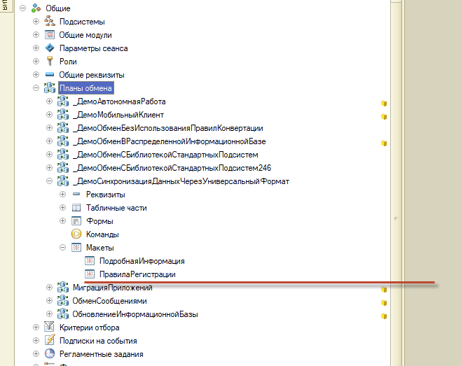
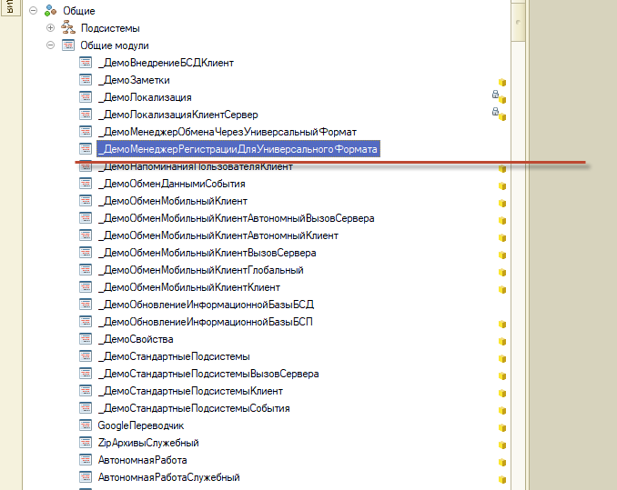

###### #std799

# Разработка правил регистраций

Правила регистрации — алгоритмы, которые описывают проверки, фильтры и отборы данных, участвующих в синхронизации данных (обменах).
Под данными понимаются как ссылочные, так и не ссылочные объекты.

###### 1.

Правила регистрации размещайте в модулях конфигурации, например поставляйте отдельным общим модулем — менеджером регистрации.

!!! failure "Неправильно"

    Правила регистрации хранятся в макете плана обмена.

    ```text
    Планы обмена
        _ДемоСинхронизацияДанныхЧерезУниверсальныйФормат
            Макеты
                ПравилаРегистрации
    ```

    { width="658" }

!!! success "Правильно"

    Правила регистрации хранятся в общем модуле — менеджере регистрации.

    ```text
    Общие модули
        _ДемоМенеджерРегистрацииДляУниверсальногоФормата
    ```

    { width="678" }

Поставка правил регистрации в модулях:

- позволяет включить их во все типовые и дополнительные проверки, например в синтаксическую проверку платформой;
- позволяет автоматизировать выпуск исправлений и отслеживать их применимость;
- упрощает отладку кода: не нужно подключать внешние обработки отладки;
- сокращает затраты на автоматический перевод кода и выпуск WE-версий приложений;
- повышает читаемость алгоритмов и процедур-событий правила регистрации.

###### 2.

В правилах регистрации не изменяйте безопасный и привилегированный режимы.
Запрещено использовать методы и конструкции, которые переключают привилегированный и безопасный режимы работы `1С:Предприятия`.

Требование повышает безопасность и отказоустойчивость кода.

###### 3.

Исправления ошибок в правилах обмена поставляйте расширениями (патчами).

###### См. также

- [#std701: Разработка планов обмена с отборами](701.md)
- [#std485: Использование привилегированного режима](485.md)
- [Описание инструмента «Конвертация данных»](https://its.1c.ru/db/metod8dev/content/2943/hdoc)
- [Разработка правил регистрации — документация БСП](https://its.1c.ru/db/bsp321doc/content/4/hdoc/issogl3_правила_регистрации)

###### Источник

https://its.1c.ru/db/v8std#content:799
